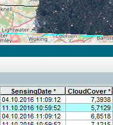
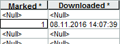

## Purpose
Provide assistence to occasional users to deal with Sentinel data in a local ArcGIS Desktop environment by means of two Python Toolbox tools and common ArcGIS Desktop experience:

1. **Search** Data Hub Services' (DHuS) product catalog for Sentinel-2 L1C products according to given criteria (in particular spatiotemporal constraints and cloud cover limit).  
  The search results are stored into a local product catalog (raster catalog) acting as a controllable cache (for product metadata and previews).  
  
2. Interactively browse metadata (attribute table) and product previews (by selecting product records); mark desired product records for download.
3. With each _Marked_ entry in the local product catalog, **Download** the respective raster data package.
  

On download success, the respective raster datasets are presented in ArcMap.

#### Characteristics
* Products that conform to the newer version (>=14) of the Products Specification Document (PSD) are handled, but ArcGIS does not yet support it in terms of a built-in raster product; as a substitute for this, the natural color composite (TCI) is used for the _Download_ tool output parameter.

## Prerequisites
* Valid login credentials for DHuS ([self-registration](https://scihub.copernicus.eu/userguide)).
* Tested with ArcGIS Desktop 10.4.1.
* [ArcGIS 10.4.1 Raster Patch](http://support.esri.com/Products/Desktop/arcgis-desktop/arcmap/10-4-1#downloads?id=7396).
* On affected systems: [ArcGIS Runtime Error R6034 Patch](http://support.esri.com/download/7391).

## Getting Started
* [Download ZIP](../../archive/master.zip) and extract its content to a local directory that can be reached by an ArcCatalog _Folder Connection_.  
  Make sure that the original file structure is preserved (relative paths); all referenced files have to be properly placed with respect to the main Toolbox files (.pyt, \*.xml), by name sensub.py and all \*.lyr files within their respective subdirectory.  
  📓 **Note**: Do not simply drag and drop the Toolbox icon to a desired ArcCatalog _Folder Connection_ (e.g. "My Toolboxes"), because by doing so ArcCatalog copies only the Toolbox .pyt file in conjunction with its belonging *.xml help files but leaves out all other dependend files!
* Before using the tools, it is highly advised to read the respective _Item Description_ of the Toolbox and of each tool in advance (see respective context menu in ArcMap), particularly the respective _Usage_ of each tool (also reachable from each _Tool Help_). Amongst others, the _Usage_ of the _Search_ tool introductorily explains some general ArcMap settings that have to be carried out beforehand.  
  When running the parameter form of a particular tool, consult the respective _Parameter Explanation_ shown in the side panel (button "Show Help >>" opens the side panel).
